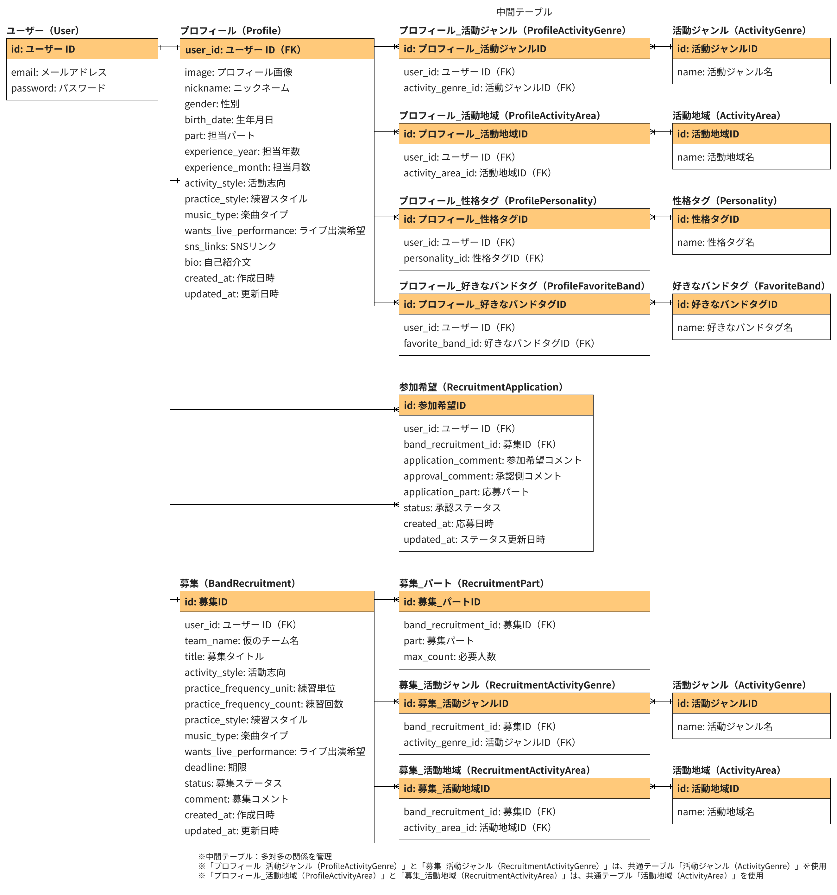

# はじめに
Gather Bandは、バンドの募集者と応募者が互いの相性を確認し、マッチングできるバンドマッチングアプリです。
相性や活動の方向性を確認してからバンドを組めるマッチングアプリが欲しいと思い、開発しました。

※本アプリはポートフォリオのため、ご利用いただくことでのトラブル等は一切責任を負いかねます。

アプリURL：

# 開発背景
バンド募集サイトでバンドが結成されても、相性の問題で関係性が継続できず、結成したバンドが継続することは難しいと感じていました。
そこで、募集相性や、人物相性を設けることで、バンド結成前に相性や活動の方向性を確認し、ずれを少なくしたいと考え、このアプリを開発しました。
同時に、CRUD実装からUI/UX設計・運用など、WEB開発のプロセスを一通り経験することも目的としています。

# 主な使用技術
バックエンド

フロントエンド

インフラ・DB

ツール

# 機能一覧
| 機能 |　詳細 |
|---|---|
| ユーザー登録・ログイン | ユーザーは新規登録・ログインが可能です。 |
| プロフィール登録・編集 | プロフィールの登録・編集が可能です。 |
| 全体募集一覧 | 全体の募集一覧を閲覧できます。自分のパート・活動地域と一致した募集を自動的に絞り込み表示します。募集相性も表示されます。ログインユーザーは募集を作成できます。 |
| 自分の募集一覧 | 自分の募集を編集・削除できます。参加メンバーの確認ができます。 |
| 参加希望-自分から | 自分が参加希望した募集の一覧とマッチング状況を確認できます。 |
| 参加希望-相手から | 相手から参加希望のあった自分の募集一覧を確認できます。応募者との相性確認や応募者のプロフィールを閲覧し、マッチング可否を決定できます。 |
| 募集詳細 | 募集内容の詳細と募集者のプロフィールを閲覧できます。ログインユーザーは参加希望ボタンから募集への参加が可能です。 |
| 相性表示 | 応募者は全体の募集一覧で募集内容との募集相性を確認できます。 また、募集者は自分の募集ごとに応募者との人物相性を確認できます。|

※人物相性は、好きなバンドタグ一致率、性格タグ一致率をもとに算出しています
※募集相性は、活動ジャンル、楽曲タイプ、活動志向をもとに算出しています

# ER図

# 意識した点
*

# 将来実装予定の機能
| 機能 |　詳細 |
|---|---|
| 承認コメント | 承認時に応募者へのコメントを可能とします。 |
| 募集一覧のソート | 募集期限が短い順/新着順などでのソートを可能とします。 |
| 募集の絞り込み | 指定の値で募集内容の絞り込みを可能とします。 |
| チーム掲示板 | 全てのメンバーが揃ったら、チーム掲示板内でのやりとりを可能とします。 |
| スカウト | ユーザーのプロフィールを確認し、バンドに加入してほしいユーザーへのスカウトを可能とします。 |

# 終わりに

